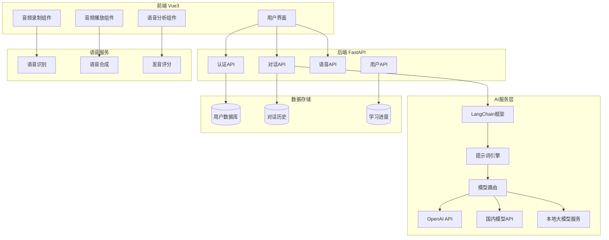
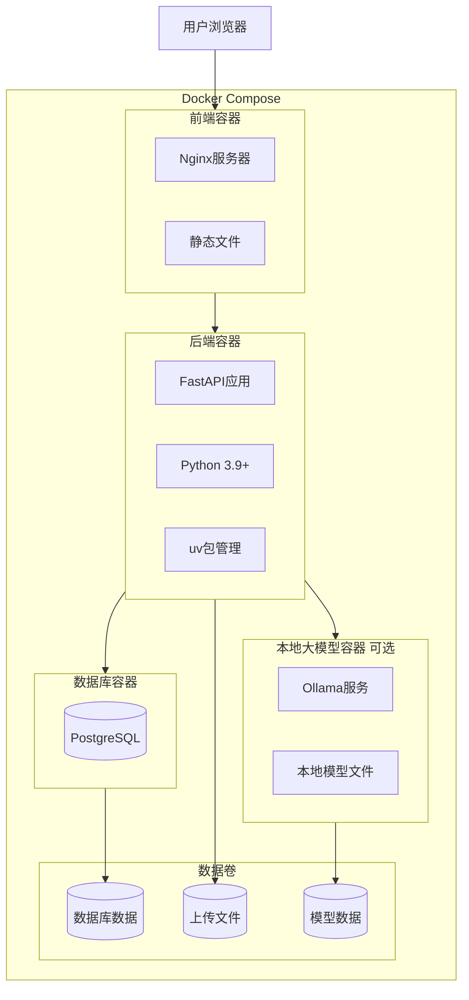

# 小学生英语

口语训练WEB应用开发计划

## 项目概述

开发一个面向中国小学生的英语口语对话训练WEB应用，通过AI大模型提供趣味化、生活化的对话练习，自动引导和鼓励学生开口，并提供发音纠正功能。

## 技术架构

### 技术栈

- **后端**: Python 3.9+, FastAPI, LangChain, SQLAlchemy, PostgreSQL/SQLite
- **Python包管理**: uv (快速Python包管理工具)
- **前端**: Vue 3, TypeScript, Element Plus / Ant Design Vue, Web Audio API
- **移动端支持**: 响应式设计、触摸交互、PWA（Progressive Web App）
- **Node.js版本管理**: nvm (Node Version Manager)
- **容器化**: Docker, Docker Compose
- **AI模型**: 支持云端模型（OpenAI、通义千问、文心一言、智谱AI）和本地大模型（Ollama、LocalAI等）多模型切换
- **本地大模型**: Ollama（推荐）、LocalAI、vLLM等本地部署方案
- **语音服务**: Web Speech API (浏览器端STT) + 第三方TTS API + 发音评分API

### 系统架构图




## 开发阶段

### 第一阶段：项目基础搭建

#### 1.1 项目结构初始化

- 创建前后端分离的项目结构
- 使用 **uv** 管理Python依赖和虚拟环境
- 使用 **nvm** 管理Node.js版本
- 设置代码规范和Git工作流
- 创建开发环境配置文档

**目录结构**:

```javascript
speaker/
├── backend/                 # Python后端
│   ├── app/
│   │   ├── api/            # API路由
│   │   ├── core/           # 核心配置
│   │   ├── models/         # 数据模型
│   │   ├── services/       # 业务逻辑
│   │   │   ├── ai_service.py      # AI对话服务
│   │   │   ├── local_model_service.py  # 本地大模型服务
│   │   │   ├── voice_service.py   # 语音服务
│   │   │   └── user_service.py    # 用户服务
│   │   └── utils/          # 工具函数
│   ├── pyproject.toml      # uv项目配置（替代requirements.txt）
│   ├── uv.lock             # uv锁定文件
│   ├── Dockerfile          # 后端Docker镜像
│   ├── .dockerignore       # Docker忽略文件
│   └── main.py
├── frontend/               # Vue3前端
│   ├── src/
│   │   ├── components/     # 组件
│   │   ├── views/          # 页面
│   │   ├── services/       # API服务
│   │   ├── stores/         # 状态管理
│   │   └── utils/          # 工具函数
│   ├── .nvmrc              # nvm Node.js版本配置
│   ├── Dockerfile          # 前端Docker镜像
│   ├── .dockerignore       # Docker忽略文件
│   ├── package.json
│   └── package-lock.json
├── docker-compose.yml      # Docker Compose配置（开发环境）
├── docker-compose.prod.yml # Docker Compose配置（生产环境）
├── .gitignore
├── README.md
└── docs/                   # 文档
    ├── setup.md            # 开发环境配置文档
    ├── docker.md           # Docker使用文档
    └── local_models.md     # 本地大模型配置文档
```

**开发环境配置步骤**:

1. **安装 uv** (Python包管理):
   ```bash
                     # macOS/Linux
                     curl -LsSf https://astral.sh/uv/install.sh | sh
                     
                     # 或使用pip
                     pip install uv
   ```


2. **安装 nvm** (Node.js版本管理):
   ```bash
                     # macOS/Linux
                     curl -o- https://raw.githubusercontent.com/nvm-sh/nvm/v0.39.0/install.sh | bash
   ```


3. **后端环境设置**:
   ```bash
                     cd backend
                     # 使用uv创建Python项目
                     uv init
                     # 安装依赖
                     uv sync
                     # 激活虚拟环境
                     source .venv/bin/activate  # Linux/macOS
   ```


4. **前端环境设置**:
   ```bash
                     cd frontend
                     # 使用nvm安装指定Node.js版本
                     nvm install
                     nvm use
                     # 安装npm依赖
                     npm install
   ```


**关键配置文件**:

- `backend/pyproject.toml`: uv项目配置文件，定义Python版本和依赖
- `frontend/.nvmrc`: 指定Node.js版本（如: `18.20.0`）
- `backend/Dockerfile`: 后端Docker镜像构建文件
- `frontend/Dockerfile`: 前端Docker镜像构建文件
- `docker-compose.yml`: Docker Compose开发环境配置
- `docker-compose.prod.yml`: Docker Compose生产环境配置
- `.gitignore`: 忽略虚拟环境、node_modules等文件

#### 1.2 Docker配置

- 创建后端Dockerfile（基于Python官方镜像，使用uv）
- 创建前端Dockerfile（多阶段构建，生产环境使用nginx）
- 配置docker-compose.yml（开发环境：包含后端、前端、数据库服务）
- 配置docker-compose.prod.yml（生产环境配置）
- 创建.dockerignore文件（优化构建速度）
- 编写Docker使用文档
- **本地大模型服务配置**（可选）:
- 在docker-compose.yml中添加Ollama服务（如需要本地模型）
- 配置本地模型服务的网络和存储卷
- 设置本地模型服务的资源限制（CPU、内存、GPU）
- 提供本地模型服务的健康检查和自动重启

**关键文件**: `backend/Dockerfile`, `frontend/Dockerfile`, `docker-compose.yml`, `docker-compose.prod.yml`, `docs/docker.md`**Docker配置要点**:

- 后端使用uv进行依赖管理，优化镜像大小
- 前端使用多阶段构建，最终镜像仅包含nginx和静态文件
- 开发环境支持热重载（volumes挂载）
- 生产环境优化镜像大小和安全性
- 本地大模型服务（Ollama）可作为可选服务，根据需求启用

#### 1.3 后端基础框架

- 搭建FastAPI应用框架
- 配置数据库连接（SQLAlchemy + SQLite/PostgreSQL）
- 实现基础中间件（CORS、认证、日志）
- 创建用户模型和认证系统

**关键文件**: `backend/app/main.py`, `backend/app/core/config.py`, `backend/app/models/user.py`

#### 1.4 前端基础框架

- 初始化Vue 3项目（Vite）
- 配置路由（Vue Router）
- 配置状态管理（Pinia）
- 集成UI组件库（Element Plus或Ant Design Vue，需支持移动端响应式）
- 设计童趣化的UI主题和组件样式
- **移动端适配**:
- 配置响应式布局（使用CSS Grid/Flexbox）
- 设置viewport meta标签（适配移动设备）
- 实现触摸友好的交互设计（按钮大小、间距）
- 配置移动端CSS框架（如Tailwind CSS响应式工具类）
- 添加移动端检测和适配逻辑
- **PWA支持**（可选但推荐）:
- 配置Service Worker
- 添加Web App Manifest
- 实现离线缓存策略
- 支持添加到主屏幕功能

**关键文件**: `frontend/src/main.ts`, `frontend/src/router/index.ts`, `frontend/src/stores/user.ts`, `frontend/src/utils/device.ts`, `frontend/public/manifest.json`

### 第二阶段：AI对话核心功能

#### 2.1 LangChain集成

- 集成LangChain框架
- 实现多模型支持（云端模型：OpenAI、通义千问、文心一言、智谱AI；本地模型：Ollama、LocalAI等）
- 创建模型配置管理和切换机制
- **本地大模型集成**:
- 集成Ollama（推荐，易于部署和使用）
- 或集成LocalAI（兼容OpenAI API格式）
- 实现本地模型连接和调用逻辑
- 配置本地模型服务地址和参数
- 实现模型健康检查和自动重连
- 支持本地模型流式输出（Streaming）
- **模型路由机制**:
- 支持根据配置选择云端或本地模型
- 实现模型优先级和降级策略
- 支持模型切换（运行时切换）
- 记录模型使用日志和性能指标

**关键文件**: `backend/app/services/ai_service.py`, `backend/app/services/local_model_service.py`, `backend/app/core/model_config.py`

```python
# 核心功能示例
- ModelRouter类：根据配置路由到不同AI模型（云端/本地）
- LangChainChain类：封装对话链
- PromptTemplate类：管理提示词模板
- LocalModelService类：本地模型服务封装（Ollama/LocalAI）
- ModelConfig类：模型配置管理（支持环境变量和配置文件）
```


#### 2.2 提示词工程

- 设计针对中国小学生的提示词模板
- 实现对话引导逻辑（鼓励开口、纠正错误）
- 创建不同场景的对话模板（日常生活、学校、家庭等）

**关键文件**: `backend/app/services/prompt_service.py`

```python
# 提示词设计要点
- 使用简单易懂的英语
- 融入中国小学生生活场景
- 设置鼓励性语言
- 包含发音纠正指导
- 根据学生水平动态调整难度
```


#### 2.3 对话API开发

- 实现对话接口（接收用户输入，返回AI回复）
- 实现对话历史管理
- 添加对话上下文管理（保持对话连贯性）

**关键文件**: `backend/app/api/chat.py`, `backend/app/services/chat_service.py`

#### 2.4 前端对话界面

- 设计对话UI组件（消息气泡、输入框）
- 实现实时对话交互
- 添加打字动画效果（增强趣味性）
- 实现对话历史展示
- **移动端适配**:
- 响应式对话界面布局（移动端单列，平板双列）
- 移动端优化的输入框（全屏输入模式，避免键盘遮挡）
- 触摸友好的按钮和交互元素（最小44x44px触摸区域）
- 移动端手势支持（滑动删除、下拉刷新）
- 适配不同屏幕尺寸（手机竖屏/横屏、平板）
- 虚拟键盘适配（输入框自动滚动到可视区域）

**关键文件**: `frontend/src/components/ChatWindow.vue`, `frontend/src/views/Conversation.vue`, `frontend/src/components/MobileChatInput.vue`

### 第三阶段：语音功能实现

#### 3.1 语音识别（STT）

- 集成浏览器Web Speech API（前端）
- 或集成第三方STT服务（如讯飞、百度、Azure）
- 实现音频录制和转文字功能
- 添加录音可视化效果
- **移动端适配**:
- 移动端麦克风权限请求和处理
- 适配移动端浏览器的Web Speech API（iOS Safari、Android Chrome）
- 移动端录音按钮优化（大尺寸、易于触摸）
- 录音时的视觉反馈（动画、震动反馈）
- 处理移动端浏览器兼容性问题（降级方案）
- 移动端音频格式兼容性处理

**关键文件**: `frontend/src/components/AudioRecorder.vue`, `backend/app/services/stt_service.py`, `frontend/src/utils/mobileAudio.ts`

#### 3.2 语音合成（TTS）

- 集成TTS API（如Azure、Google、讯飞、百度）
- 实现AI回复的语音播放
- 添加语音播放控制（暂停、重播、语速调节）
- **移动端适配**:
- 移动端音频播放优化（自动播放策略、用户交互触发）
- 移动端音频播放控制（大按钮、易于操作）
- 处理移动端浏览器音频自动播放限制
- 移动端音频播放状态指示（播放中、暂停、加载中）
- 支持移动端后台播放（可选）

**关键文件**: `frontend/src/components/AudioPlayer.vue`, `backend/app/services/tts_service.py`, `frontend/src/utils/mobileAudio.ts`

#### 3.3 发音评分

- 集成发音评分API（如讯飞、流利说、Azure Pronunciation Assessment）
- 实现发音准确度评分
- 提供发音反馈和建议
- 可视化展示评分结果（星级、分数、改进建议）

**关键文件**: `frontend/src/components/PronunciationScore.vue`, `backend/app/services/pronunciation_service.py`

#### 3.4 语音功能整合

- 将STT、TTS、发音评分整合到对话流程
- 实现语音对话模式（纯语音交互）
- 添加语音设置（语言、语速、音量）
- **移动端优化**:
- 移动端语音对话界面优化（大按钮、清晰提示）
- 移动端语音权限引导和说明
- 移动端网络状态检测（WiFi/4G/5G）
- 移动端音频质量自适应（根据网络状况调整）
- 移动端省电优化（减少不必要的音频处理）

**关键文件**: `frontend/src/views/VoiceConversation.vue`, `frontend/src/views/MobileVoiceConversation.vue`

### 第四阶段：用户系统与学习追踪

#### 4.1 用户认证

- 实现用户注册/登录功能
- JWT token认证
- 密码加密存储
- 用户信息管理

**关键文件**: `backend/app/api/auth.py`, `frontend/src/views/Login.vue`, `frontend/src/views/Register.vue`

#### 4.2 学习记录

- 记录每次对话会话
- 保存学习时长、对话次数
- 记录发音评分历史
- 实现学习数据统计

**关键文件**: `backend/app/models/conversation.py`, `backend/app/models/progress.py`

#### 4.3 学习进度

- 设计学习进度追踪系统
- 实现成就系统（徽章、等级）
- 可视化学习数据（图表、统计）
- 生成学习报告

**关键文件**: `backend/app/api/progress.py`, `frontend/src/views/Dashboard.vue`, `frontend/src/components/ProgressChart.vue`

### 第五阶段：优化与增强功能

#### 5.1 对话场景扩展

- 添加不同主题场景（学校、家庭、购物、旅行等）
- 实现场景切换功能
- 根据场景调整对话内容和难度

**关键文件**: `backend/app/services/scenario_service.py`, `frontend/src/components/ScenarioSelector.vue`

#### 5.2 个性化学习

- 根据学生水平推荐对话内容
- 实现自适应难度调整
- 添加学习目标设置

#### 5.3 家长功能（可选）

- 家长查看孩子学习报告
- 设置学习时长限制
- 查看学习建议

#### 5.4 移动端适配与优化

- **响应式设计完善**:
- 测试不同设备尺寸（手机320px-768px，平板768px-1024px）
- 优化移动端布局和排版
- 移动端字体大小和行高优化（确保可读性）
- 移动端图片和媒体资源优化（懒加载、压缩）
- **移动端性能优化**:
- 移动端代码分割和懒加载
- 移动端资源压缩（CSS、JS、图片）
- 移动端网络请求优化（减少请求次数、使用CDN）
- 移动端缓存策略优化
- 移动端首屏加载优化（关键资源优先加载）
- **移动端用户体验优化**:
- 移动端加载状态提示（骨架屏、加载动画）
- 移动端错误处理和提示优化
- 移动端操作反馈优化（触摸反馈、动画）
- 移动端横竖屏切换适配
- 移动端安全区域适配（刘海屏、底部导航栏）
- **移动端测试**:
- 真机测试（iOS Safari、Android Chrome）
- 移动端浏览器兼容性测试
- 移动端性能测试（加载速度、内存占用）
- 移动端网络环境测试（3G/4G/5G/WiFi）

**关键文件**: `frontend/src/utils/responsive.ts`, `frontend/src/composables/useMobile.ts`, `frontend/src/styles/mobile.scss`

#### 5.5 性能优化

- 前端代码优化（懒加载、代码分割）
- 后端API性能优化（缓存、异步处理）
- 音频处理优化（压缩、流式传输）

### 第六阶段：测试与部署

#### 6.1 测试

- 单元测试（后端API、前端组件）
- 集成测试（完整对话流程）
- 用户体验测试
- **移动端专项测试**:
- 移动端功能测试（对话、语音、发音评分）
- 移动端兼容性测试（iOS Safari、Android Chrome、微信内置浏览器）
- 移动端性能测试（加载速度、内存占用、电池消耗）
- 移动端网络测试（3G/4G/5G/WiFi、弱网环境）
- 移动端设备测试（不同屏幕尺寸、分辨率、系统版本）
- 移动端权限测试（麦克风权限请求和处理）
- 移动端横竖屏切换测试
- 移动端手势和触摸交互测试

#### 6.2 部署准备

- 配置生产环境
- 设置环境变量管理
- 准备部署文档

#### 6.3 部署

- 使用Docker Compose进行一键部署
- 配置生产环境Docker镜像
- 设置环境变量和密钥管理
- 配置数据库迁移（Docker容器内执行）
- 配置反向代理（nginx）和SSL证书
- 设置健康检查和自动重启策略
- **本地大模型部署**（可选）:
- 在docker-compose.yml中启用Ollama服务
- 配置Ollama模型存储卷（持久化模型文件）
- 设置Ollama资源限制（CPU、内存、GPU）
- 配置Ollama健康检查和自动重启
- 下载所需的模型文件（首次部署）

**Docker部署命令**:

```bash
# 开发环境（包含本地模型服务）
docker-compose up -d

# 开发环境（不包含本地模型服务）
docker-compose up -d --scale ollama=0

# 生产环境
docker-compose -f docker-compose.prod.yml up -d

# 查看日志
docker-compose logs -f

# 查看Ollama服务日志
docker-compose logs -f ollama

# 停止服务
docker-compose down

# 下载Ollama模型（在Ollama容器中）
docker-compose exec ollama ollama pull llama3.2:3b
```


## 关键技术实现要点

### AI提示词设计示例

```javascript
你是一位友好的英语老师，专门帮助中国小学生练习英语口语。
- 使用简单、清晰的英语（适合小学生水平）
- 对话内容贴近中国小学生的日常生活（学校、家庭、游戏等）
- 积极鼓励学生开口说话，使用鼓励性语言
- 当学生发音或语法有误时，温和地纠正并给出正确示例
- 根据学生的回答调整对话难度
- 保持对话趣味性，可以适当使用表情符号或有趣的话题
```


### 本地大模型配置说明

**Ollama集成（推荐）**:

- **安装和部署**:
  ```bash
              # 使用Docker部署Ollama
              docker run -d -v ollama:/root/.ollama -p 11434:11434 --name ollama ollama/ollama
              
              # 或使用docker-compose（推荐）
              # 在docker-compose.yml中添加ollama服务
  ```


- **下载模型**:
  ```bash
              # 推荐模型（适合英语教学）
              ollama pull llama3.2:3b          # 轻量级，适合资源受限环境
              ollama pull qwen2.5:7b             # 中文友好，支持中英文混合
              ollama pull mistral:7b             # 性能平衡
              ollama pull llama3.1:8b            # 高质量对话
  ```


- **LangChain集成**:
  ```python
              from langchain_ollama import OllamaLLM
              
              # 创建Ollama LLM实例
              llm = OllamaLLM(
                  model="llama3.2:3b",
                  base_url="http://ollama:11434",  # Docker内部网络
                  temperature=0.7
              )
  ```


- **配置管理**:
- 使用环境变量配置本地模型服务地址
- 支持模型切换和降级策略
- 实现模型健康检查和自动重连

**LocalAI集成（可选）**:

- LocalAI兼容OpenAI API格式，可以无缝替换
- 支持更多模型格式（GGUF、GGML等）
- 配置方式类似OpenAI客户端

**本地模型优势**:

- 数据隐私：对话数据不离开本地环境
- 成本控制：无需API调用费用
- 离线使用：不依赖网络连接
- 自定义：可以微调模型适配特定场景

**本地模型注意事项**:

- 需要足够的硬件资源（CPU/内存/GPU）
- 响应速度可能较慢（取决于硬件）
- 需要定期更新和维护模型
- 建议使用GPU加速（可选但推荐）

### 语音功能技术选型建议

- **STT**: Web Speech API（免费，浏览器支持）或 讯飞/百度STT API（准确度高）
- **TTS**: Azure Cognitive Services（多语言支持好）或 讯飞TTS（中文场景友好）
- **发音评分**: Azure Pronunciation Assessment API 或 讯飞发音评测API

### 移动端适配要点

**响应式设计原则**:

- 移动优先（Mobile First）设计策略
- 使用CSS媒体查询实现断点适配
- 推荐断点：手机（<768px）、平板（768px-1024px）、桌面（>1024px）
- 使用相对单位（rem、em、vw、vh）而非固定像素

**触摸交互设计**:

- 按钮最小触摸区域：44x44px（iOS）或48x48px（Android）
- 按钮间距：至少8px，避免误触
- 支持常见手势：点击、长按、滑动、捏合
- 提供触摸反馈：视觉反馈（高亮）和触觉反馈（震动）

**移动端语音功能注意事项**:

- iOS Safari需要用户交互才能启动音频录制
- Android Chrome对Web Speech API支持较好
- 移动端麦克风权限需要明确请求和说明
- 移动端音频自动播放受限，需要用户交互触发
- 考虑移动端网络环境，实现音频质量自适应

**移动端性能优化**:

- 图片使用WebP格式，提供多尺寸适配
- 使用懒加载减少初始加载时间
- 关键CSS内联，非关键CSS异步加载
- 使用Service Worker实现离线缓存
- 减少DOM操作，使用虚拟滚动（长列表）

**移动端UI/UX设计**:

- 简化导航，使用底部导航栏（移动端）
- 重要操作放在易于触摸的位置
- 使用大字体和清晰对比度
- 避免使用hover效果（移动端不支持）
- 适配安全区域（iOS刘海屏、Android导航栏）

### 数据库设计要点

- 用户表（id, username, email, password_hash, created_at）
- 对话会话表（id, user_id, scenario, started_at, ended_at）
- 对话消息表（id, session_id, role, content, audio_url, pronunciation_score, created_at）
- 学习进度表（id, user_id, total_conversations, total_time, average_score, updated_at）

## 开发时间估算

- 第一阶段：3-5天（包含Docker配置）
- 第二阶段：5-7天（包含移动端基础适配）
- 第三阶段：7-10天（包含移动端语音功能适配）
- 第四阶段：5-7天
- 第五阶段：7-10天（包含移动端优化和测试）
- 第六阶段：3-5天

**总计**: 约5-7周（根据开发人员经验调整，移动端适配会增加约1周时间）

## Docker配置说明

### Docker架构




### Docker Compose服务配置

**开发环境** (`docker-compose.yml`):

- `backend`: FastAPI应用，支持热重载
- `frontend`: Vue开发服务器，支持HMR
- `db`: PostgreSQL数据库
- `ollama`: Ollama本地大模型服务（可选，根据需要启用）
- `volumes`: 代码挂载，实现实时更新

**生产环境** (`docker-compose.prod.yml`):

- `backend`: 优化的FastAPI生产镜像
- `frontend`: Nginx静态文件服务
- `db`: PostgreSQL数据库（数据持久化）
- `ollama`: Ollama本地大模型服务（可选，需要GPU支持）
- `nginx`: 反向代理和负载均衡（可选）

### Dockerfile示例结构

**后端Dockerfile** (`backend/Dockerfile`):

```dockerfile
# 使用Python官方镜像
FROM python:3.11-slim

# 安装uv
COPY --from=ghcr.io/astral-sh/uv:latest /uv /usr/local/bin/uv

# 设置工作目录
WORKDIR /app

# 复制依赖文件
COPY pyproject.toml uv.lock ./

# 安装依赖
RUN uv sync --frozen

# 复制应用代码
COPY . .

# 暴露端口
EXPOSE 8000

# 启动命令
CMD ["uv", "run", "uvicorn", "app.main:app", "--host", "0.0.0.0", "--port", "8000"]
```

**前端Dockerfile** (`frontend/Dockerfile`):

```dockerfile
# 构建阶段
FROM node:18-alpine AS builder
WORKDIR /app
COPY package*.json ./
RUN npm ci
COPY . .
RUN npm run build

# 生产阶段
FROM nginx:alpine
COPY --from=builder /app/dist /usr/share/nginx/html
COPY nginx.conf /etc/nginx/conf.d/default.conf
EXPOSE 80
CMD ["nginx", "-g", "daemon off;"]
```


### Docker常用命令

```bash
# 构建镜像
docker-compose build

# 启动所有服务
docker-compose up -d

# 查看服务状态
docker-compose ps

# 查看日志
docker-compose logs -f [service_name]

# 进入容器
docker-compose exec backend bash

# 停止服务
docker-compose down

# 停止并删除数据卷
docker-compose down -v

# 重新构建并启动
docker-compose up -d --build

# 生产环境部署
docker-compose -f docker-compose.prod.yml up -d --build
```


## 开发工具使用说明

### uv (Python包管理)

**优势**:

- 比pip快10-100倍
- 自动管理虚拟环境
- 统一的依赖锁定机制
- 支持pyproject.toml标准

**常用命令**:

```bash
# 初始化项目
uv init

# 添加依赖
uv add fastapi langchain

# 安装所有依赖
uv sync

# 运行应用
uv run python main.py

# 激活虚拟环境
source .venv/bin/activate
```


### nvm (Node.js版本管理)

**优势**:

- 轻松切换Node.js版本
- 项目级别版本锁定
- 避免全局版本冲突

**常用命令**:

```bash
# 安装指定版本
nvm install 18.20.0

# 使用项目指定版本（读取.nvmrc）
nvm use

# 设置默认版本
nvm alias default 18.20.0

# 查看当前版本
nvm current
```


## 注意事项

1. **API密钥安全**: 所有AI和语音服务的API密钥应存储在环境变量中，不要提交到代码仓库
2. **音频文件处理**: 考虑音频文件存储方案（本地存储或云存储如OSS）
3. **浏览器兼容性**: Web Speech API在不同浏览器支持情况不同，需要做兼容处理
4. **用户体验**: 界面设计要符合小学生审美，使用明亮色彩、可爱图标、简单操作
5. **性能考虑**: 语音文件可能较大，需要优化传输和存储
6. **版本管理**: 使用.nvmrc和pyproject.toml确保团队成员使用相同的Node.js和Python版本
7. **依赖锁定**: uv.lock和package-lock.json应提交到Git，确保依赖版本一致性
8. **Docker环境**: 开发环境推荐使用Docker Compose，确保环境一致性；生产环境使用优化的Docker镜像
9. **数据持久化**: Docker容器中的数据应使用volumes持久化，避免数据丢失
10. **容器安全**: 生产环境Docker镜像应使用非root用户运行，最小化镜像大小
11. **隐私保护**: 对话内容涉及儿童隐私，需要做好数据保护
12. **移动端适配**: 必须进行真机测试，确保在不同移动设备和浏览器上的兼容性